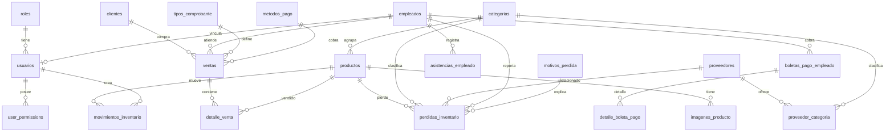

# Mapeo de Base de Datos y Prompt Maestro del Proyecto

Proyecto basado en PostgreSQL, backend Node.js con Prisma y frontend Next.js + React + CSS con una interfaz de estilo luxury: elegante, profesional, densa en informacion y facil de operar.

Stack vigente:

- Frontend: Next.js + React + CSS puro.
- Backend: Node.js + Express + TypeScript.
- ORM: Prisma.
- Base de datos: PostgreSQL.

## 1. Resumen del dominio

La base de datos modela un sistema comercial/operativo con estos bloques:

- Seguridad y usuarios: roles, usuarios y permisos por modulo.
- Personal: empleados, asistencias y boletas de pago.
- Catalogo e inventario: categorias, productos, imagenes, proveedores y movimientos.
- Ventas: clientes, metodos de pago, comprobantes, ventas y detalle de venta.
- Perdidas: motivos de perdida y perdidas de inventario.
- Auditoria basica: fechas de creacion/actualizacion y usuarios que generan operaciones.

Motor recomendado: PostgreSQL.
Extension requerida: `pgcrypto` para generar UUID con `gen_random_uuid()`.

## 2. Tablas mapeadas

### 2.1 roles

Catalogo de roles del sistema.

Campos:

- `id`: UUID PK.
- `code`: codigo unico. Ejemplos: `admin`, `empleado`.
- `name`: nombre legible.
- `created_at`: fecha de creacion.

Relaciones:

- Uno a muchos con `usuarios`.

### 2.2 empleados

Registra trabajadores del negocio.

Campos:

- `id`: UUID PK.
- `full_name`: nombre completo.
- `dni`: documento unico.
- `position`: cargo.
- `phone`: telefono opcional.
- `hire_date`: fecha de contratacion.
- `daily_pay`: pago diario.
- `active`: estado.
- `created_at`, `updated_at`: auditoria.

Relaciones:

- Uno a uno opcional con `usuarios`.
- Uno a muchos con `ventas`.
- Uno a muchos con `asistencias_empleado`.
- Uno a muchos con `boletas_pago_empleado`.
- Uno a muchos opcional con `perdidas_inventario`.

### 2.3 usuarios

Usuarios que pueden iniciar sesion.

Campos:

- `id`: UUID PK.
- `role_id`: FK a `roles`.
- `employee_id`: FK opcional a `empleados`.
- `username`: usuario unico.
- `password_hash`: hash de contrasena.
- `active`: estado.
- `last_access_at`: ultimo acceso.
- `created_at`, `updated_at`: auditoria.

Relaciones:

- Muchos a uno con `roles`.
- Muchos a uno opcional con `empleados`.
- Uno a muchos con `user_permissions`.
- Uno a muchos opcional con `boletas_pago_empleado`.
- Uno a muchos opcional con `movimientos_inventario`.

### 2.4 user_permissions

Permisos granulares por usuario y modulo.

Campos:

- `id`: UUID PK.
- `user_id`: FK a `usuarios`.
- `module_key`: clave del modulo.
- `can_view`, `can_create`, `can_edit`, `can_delete`: permisos CRUD.
- `created_at`, `updated_at`: auditoria.

Restricciones:

- Unico por `user_id` + `module_key`.
- Se elimina en cascada al eliminar usuario.

Modulos sugeridos:

- `dashboard`
- `usuarios`
- `empleados`
- `asistencias`
- `boletas_pago`
- `categorias`
- `productos`
- `proveedores`
- `clientes`
- `ventas`
- `perdidas`
- `inventario`
- `reportes`

### 2.5 categorias

Catalogo de categorias de productos.

Campos:

- `id`: UUID PK.
- `name`: nombre unico.
- `slug`: slug unico.
- `active`: estado.
- `created_at`: creacion.

Relaciones:

- Uno a muchos con `productos`.
- Muchos a muchos con `proveedores` mediante `proveedor_categoria`.
- Uno a muchos con `perdidas_inventario`.

### 2.6 productos

Catalogo principal de productos.

Campos:

- `id`: UUID PK.
- `category_id`: FK a `categorias`.
- `name`: nombre.
- `slug`: slug unico.
- `unit_name`: unidad de medida.
- `stock`: stock actual.
- `min_stock`: stock minimo.
- `sale_price`: precio de venta.
- `cost_price`: costo.
- `icon_code`: codigo visual opcional para UI.
- `description`: descripcion.
- `active`: estado.
- `created_at`, `updated_at`: auditoria.

Relaciones:

- Muchos a uno con `categorias`.
- Uno a muchos con `imagenes_producto`.
- Uno a muchos con `detalle_venta`.
- Uno a muchos con `perdidas_inventario`.
- Uno a muchos con `movimientos_inventario`.

Reglas:

- `stock`, `min_stock`, `sale_price` y `cost_price` no pueden ser negativos.

### 2.7 imagenes_producto

Imagenes asociadas a cada producto.

Campos:

- `id`: UUID PK.
- `product_id`: FK a `productos`.
- `image_url`: URL de la imagen.
- `sort_order`: posicion de 1 a 4.
- `is_primary`: indica imagen principal.
- `created_at`: creacion.

Restricciones:

- Unico por `product_id` + `sort_order`.
- Se elimina en cascada al eliminar producto.

### 2.8 proveedores

Proveedores del negocio.

Campos:

- `id`: UUID PK.
- `business_name`: razon social.
- `ruc`: RUC unico.
- `contact_name`: contacto.
- `phone`: telefono.
- `email`: correo.
- `active`: estado.
- `created_at`, `updated_at`: auditoria.

Relaciones:

- Muchos a muchos con `categorias`.
- Uno a muchos opcional con `perdidas_inventario`.

### 2.9 proveedor_categoria

Tabla pivote entre proveedores y categorias.

Campos:

- `id`: UUID PK.
- `supplier_id`: FK a `proveedores`.
- `category_id`: FK a `categorias`.

Restricciones:

- Unico por proveedor y categoria.
- Cascada al eliminar proveedor o categoria.

### 2.10 metodos_pago

Catalogo de formas de pago.

Campos:

- `id`: UUID PK.
- `code`: codigo unico.
- `name`: nombre.
- `active`: estado.

Seeds:

- `efectivo`
- `yape`
- `plin`
- `tarjeta`
- `transferencia`

### 2.11 tipos_comprobante

Catalogo de comprobantes.

Campos:

- `id`: UUID PK.
- `code`: codigo unico.
- `name`: nombre.
- `series_prefix`: prefijo de serie.
- `active`: estado.

Seeds:

- `boleta` con `B001`
- `factura` con `F001`
- `sin_comprobante` con `SC01`

### 2.12 clientes

Clientes para ventas.

Campos:

- `id`: UUID PK.
- `document_type`: tipo de documento.
- `document_number`: numero de documento.
- `name`: nombre.
- `address`: direccion.
- `phone`: telefono.
- `email`: correo.
- `active`: estado.
- `created_at`, `updated_at`: auditoria.

Restricciones:

- Unico por `document_type` + `document_number`.

Relaciones:

- Uno a muchos opcional con `ventas`.

### 2.13 ventas

Cabecera de venta.

Campos:

- `id`: UUID PK.
- `serie`: serie unica.
- `voucher_type_id`: FK a `tipos_comprobante`.
- `payment_method_id`: FK a `metodos_pago`.
- `client_id`: FK opcional a `clientes`.
- `employee_id`: FK a `empleados`.
- `sale_date`: fecha.
- `sale_time`: hora.
- `subtotal`: subtotal.
- `discount_pct`: porcentaje de descuento.
- `discount_amount`: monto de descuento.
- `total`: total.
- `note`: nota.
- `amount_received`: monto recibido.
- `change_amount`: vuelto.
- `created_at`: fecha de registro.

Relaciones:

- Muchos a uno con `tipos_comprobante`.
- Muchos a uno con `metodos_pago`.
- Muchos a uno opcional con `clientes`.
- Muchos a uno con `empleados`.
- Uno a muchos con `detalle_venta`.

Reglas de negocio sugeridas:

- `total = subtotal - discount_amount`.
- `change_amount = amount_received - total` cuando el pago es efectivo.
- Al crear venta se descuenta stock y se crea movimiento `sale_out`.

### 2.14 detalle_venta

Lineas de productos vendidos.

Campos:

- `id`: UUID PK.
- `sale_id`: FK a `ventas`.
- `product_id`: FK a `productos`.
- `product_name_snapshot`: nombre del producto al momento de la venta.
- `quantity`: cantidad.
- `unit_price`: precio unitario.
- `line_total`: total de linea.
- `created_at`: creacion.

Restricciones:

- Se elimina en cascada con la venta.
- Cantidad mayor a 0.

### 2.15 asistencias_empleado

Control de asistencia diaria.

Campos:

- `id`: UUID PK.
- `employee_id`: FK a `empleados`.
- `work_date`: fecha laboral.
- `check_in_time`: hora de entrada.
- `check_out_time`: hora de salida.
- `status`: `asistio`, `falto`, `en_turno`, `pendiente`.
- `source`: `manual`, `auto_close`, `system`.
- `created_at`, `updated_at`: auditoria.

Restricciones:

- Unico por empleado y fecha.
- Cascada al eliminar empleado.

### 2.16 motivos_perdida

Catalogo de razones de perdida.

Campos:

- `id`: UUID PK.
- `name`: nombre unico.
- `active`: estado.

Seeds:

- `rotura`
- `faltante`
- `humedad`
- `merma`
- `dano_transporte`
- `ajuste_inventario`

### 2.17 perdidas_inventario

Registro de merma, rotura o perdida de stock.

Campos:

- `id`: UUID PK.
- `product_id`: FK a `productos`.
- `category_id`: FK a `categorias`.
- `supplier_id`: FK opcional a `proveedores`.
- `employee_id`: FK opcional a `empleados`.
- `loss_reason_id`: FK a `motivos_perdida`.
- `quantity`: cantidad.
- `unit_cost`: costo unitario.
- `total_cost`: costo total.
- `loss_date`: fecha.
- `loss_time`: hora.
- `note`: nota.
- `created_at`: creacion.

Reglas de negocio sugeridas:

- Al registrar perdida se descuenta stock.
- Crear movimiento de inventario `loss_out`.
- `total_cost = quantity * unit_cost`.

### 2.18 boletas_pago_empleado

Cabecera de pago mensual/quincenal de empleados.

Campos:

- `id`: UUID PK.
- `slip_number`: numero unico de boleta.
- `employee_id`: FK a `empleados`.
- `period_year`: anio.
- `period_month`: mes.
- `issue_date`: fecha de emision.
- `days_worked`: dias trabajados.
- `daily_pay`: pago diario.
- `subtotal`: subtotal.
- `discounts`: descuentos.
- `net_total`: total neto.
- `created_by_user_id`: usuario que genero la boleta.
- `created_at`: creacion.

Relaciones:

- Uno a muchos con `detalle_boleta_pago`.

Reglas sugeridas:

- `subtotal = days_worked * daily_pay`.
- `net_total = subtotal - discounts`.

### 2.19 detalle_boleta_pago

Detalle de dias trabajados que sustentan una boleta.

Campos:

- `id`: UUID PK.
- `payroll_slip_id`: FK a `boletas_pago_empleado`.
- `work_date`: fecha trabajada.
- `check_in_time`: entrada.
- `check_out_time`: salida.
- `amount`: monto del dia.

Restricciones:

- Cascada al eliminar boleta.

### 2.20 movimientos_inventario

Bitacora de movimientos de stock.

Campos:

- `id`: UUID PK.
- `product_id`: FK a `productos`.
- `movement_type`: `sale_out`, `manual_in`, `manual_out`, `loss_out`, `adjustment`.
- `reference_type`: tipo de referencia opcional.
- `reference_id`: ID de referencia opcional.
- `quantity`: cantidad.
- `unit_cost`: costo unitario opcional.
- `note`: nota.
- `created_by_user_id`: usuario responsable.
- `created_at`: fecha.

Uso recomendado:

- Fuente historica para kardex.
- Cada cambio de stock debe tener un movimiento.

## 3. Relaciones principales



## 4. Indices existentes

- `usuarios(role_id)`
- `usuarios(employee_id)`
- `user_permissions(user_id)`
- `productos(category_id, active)`
- `imagenes_producto(product_id)`
- `clientes(name)`
- `ventas(created_at)`
- `ventas(employee_id, created_at)`
- `ventas(client_id, created_at)`
- `detalle_venta(product_id)`
- `asistencias_empleado(work_date)`
- `perdidas_inventario(loss_date)`
- `boletas_pago_empleado(employee_id, period_year, period_month)`
- `movimientos_inventario(product_id, created_at)`

## 5. Modulos de aplicacion

### Dashboard

Vista ejecutiva con:

- Ventas del dia.
- Total mensual.
- Productos bajo stock.
- Ultimas ventas.
- Perdidas del mes.
- Asistencias de hoy.
- Ranking de productos vendidos.

### Seguridad

Funciones:

- Login.
- Gestion de usuarios.
- Roles.
- Permisos por modulo.
- Activar/desactivar usuarios.

### Empleados

Funciones:

- CRUD de empleados.
- Filtros por estado, cargo y DNI.
- Historial de ventas atendidas.
- Historial de asistencias.

### Asistencias

Funciones:

- Marcar entrada/salida.
- Registrar falta.
- Cierre automatico.
- Calendario mensual.

### Pagos de empleados

Funciones:

- Generar boleta por periodo.
- Tomar asistencias como base.
- Editar descuentos.
- Exportar PDF.

### Inventario

Funciones:

- CRUD categorias.
- CRUD productos.
- Carga de imagenes.
- Kardex por producto.
- Ajustes manuales.
- Alertas de stock minimo.

### Proveedores

Funciones:

- CRUD proveedores.
- Asociar categorias.
- Ver productos/categorias vinculadas.

### Clientes

Funciones:

- CRUD clientes.
- Historial de compras.

### Ventas / POS

Funciones:

- Busqueda rapida de productos.
- Carrito.
- Descuento.
- Cliente opcional.
- Metodo de pago.
- Comprobante.
- Calculo de vuelto.
- Generacion de venta.
- Descuento automatico de stock.

### Perdidas

Funciones:

- Registrar perdida.
- Elegir motivo.
- Asociar empleado/proveedor si aplica.
- Descontar stock.
- Crear movimiento `loss_out`.

### Reportes

Funciones:

- Ventas por rango.
- Ventas por empleado.
- Ventas por cliente.
- Productos mas vendidos.
- Perdidas por motivo/categoria.
- Asistencia por empleado.
- Boletas emitidas.

## 6. Reglas de separacion por dominio

Estas reglas ordenan el sistema para que cada modulo tenga una responsabilidad clara:

- Ventas solo debe relacionarse directamente con clientes, empleados que atienden, comprobantes, metodos de pago, detalle de venta e inventario.
- Ventas impacta inventario mediante salida de stock y movimiento `sale_out`.
- Ventas no debe administrar proveedores, pedidos de compra, salarios ni asistencias.
- Proveedores debe relacionarse con categorias y con pedidos de abastecimiento/compra.
- Los pedidos a proveedor deben alimentar inventario cuando sean recibidos.
- Inventario debe ser el puente operativo entre ventas, perdidas, ajustes y pedidos recibidos.
- Empleados debe concentrar informacion laboral: datos del empleado, asistencia, salario diario, boletas de pago y rendimiento operativo.
- Salario y asistencia no deben depender de ventas; pueden usarse para reportes, pero no para calcular una venta.
- Perdidas impacta inventario, pero no debe modificar ventas.
- Reportes puede cruzar informacion de varios dominios, pero no debe ejecutar cambios de negocio.

Relacion correcta por flujo:

```txt
Venta -> Detalle de venta -> Producto -> Inventario -> Movimiento sale_out
Proveedor -> Pedido a proveedor -> Recepcion de pedido -> Inventario -> Movimiento manual_in
Empleado -> Asistencia -> Boleta de pago -> Salario
Perdida -> Producto -> Inventario -> Movimiento loss_out
```

Tablas actuales que cubren estos flujos:

- Ventas: `ventas`, `detalle_venta`, `clientes`, `metodos_pago`, `tipos_comprobante`.
- Inventario: `productos`, `categorias`, `movimientos_inventario`, `perdidas_inventario`.
- Proveedores: `proveedores`, `proveedor_categoria`.
- Empleados: `empleados`, `asistencias_empleado`, `boletas_pago_empleado`, `detalle_boleta_pago`.

Tablas sugeridas si se agrega el modulo formal de pedidos a proveedor:

```sql
CREATE TABLE pedidos_proveedor (
  id UUID PRIMARY KEY DEFAULT gen_random_uuid(),
  supplier_id UUID NOT NULL REFERENCES proveedores(id),
  order_number VARCHAR(40) NOT NULL UNIQUE,
  status VARCHAR(30) NOT NULL CHECK (status IN ('borrador','enviado','recibido','cancelado')),
  order_date DATE NOT NULL,
  expected_date DATE NULL,
  subtotal NUMERIC(12,2) NOT NULL DEFAULT 0 CHECK (subtotal >= 0),
  total NUMERIC(12,2) NOT NULL DEFAULT 0 CHECK (total >= 0),
  note TEXT,
  created_by_user_id UUID NULL REFERENCES usuarios(id),
  created_at TIMESTAMPTZ NOT NULL DEFAULT NOW(),
  updated_at TIMESTAMPTZ NOT NULL DEFAULT NOW()
);

CREATE TABLE detalle_pedido_proveedor (
  id UUID PRIMARY KEY DEFAULT gen_random_uuid(),
  supplier_order_id UUID NOT NULL REFERENCES pedidos_proveedor(id) ON DELETE CASCADE,
  product_id UUID NOT NULL REFERENCES productos(id),
  quantity NUMERIC(12,2) NOT NULL CHECK (quantity > 0),
  unit_cost NUMERIC(12,2) NOT NULL CHECK (unit_cost >= 0),
  line_total NUMERIC(12,2) NOT NULL CHECK (line_total >= 0)
);
```

Regla para pedidos:

- Al marcar un pedido como `recibido`, aumentar stock de productos y crear movimiento `manual_in` o `supplier_in` si se decide ampliar el enum de `movement_type`.

## 7. Mapa de navbar, modulos y submodulos

El navbar debe organizarse como una barra lateral principal con grupos. Cada item debe validar permisos por `module_key`.

### 7.1 Dashboard

Ruta base: `/dashboard`

Submodulos:

- Resumen ejecutivo: `/dashboard`
- Ventas de hoy: `/dashboard/sales-today`
- Stock critico: `/dashboard/low-stock`
- Asistencias de hoy: `/dashboard/attendance-today`
- Indicadores mensuales: `/dashboard/monthly`

Permiso sugerido:

- `dashboard`

### 7.2 Ventas

Ruta base: `/sales`

Submodulos:

- Punto de venta POS: `/sales/pos`
- Historial de ventas: `/sales/history`
- Detalle de venta: `/sales/:id`
- Comprobantes: `/sales/vouchers`
- Metodos de pago: `/sales/payment-methods`
- Cierres de caja: `/sales/cash-close`

Permisos sugeridos:

- `ventas`
- `comprobantes`
- `metodos_pago`
- `caja`

Regla:

- Este grupo se conecta con inventario solo para descontar stock y registrar movimientos.

### 7.3 Inventario

Ruta base: `/inventory`

Submodulos:

- Productos: `/inventory/products`
- Categorias: `/inventory/categories`
- Stock actual: `/inventory/stock`
- Kardex / movimientos: `/inventory/movements`
- Ajustes de stock: `/inventory/adjustments`
- Stock minimo: `/inventory/low-stock`
- Imagenes de producto: `/inventory/product-images`

Permisos sugeridos:

- `productos`
- `categorias`
- `inventario`
- `ajustes_inventario`

Regla:

- Inventario recibe impactos desde ventas, perdidas, ajustes y pedidos recibidos.

### 7.4 Proveedores y pedidos

Ruta base: `/suppliers`

Submodulos:

- Proveedores: `/suppliers`
- Categorias por proveedor: `/suppliers/categories`
- Pedidos a proveedor: `/suppliers/orders`
- Nuevo pedido: `/suppliers/orders/new`
- Recepcion de pedido: `/suppliers/orders/:id/receive`
- Historial de compras/pedidos: `/suppliers/orders/history`

Permisos sugeridos:

- `proveedores`
- `pedidos_proveedor`
- `recepcion_pedidos`

Regla:

- Proveedores no se conecta con ventas directamente. Se conecta con inventario mediante pedidos recibidos.

### 7.5 Clientes

Ruta base: `/customers`

Submodulos:

- Lista de clientes: `/customers`
- Nuevo cliente: `/customers/new`
- Historial de compras: `/customers/:id/sales`
- Cuentas/documentos: `/customers/documents`

Permiso sugerido:

- `clientes`

### 7.6 Empleados

Ruta base: `/employees`

Submodulos:

- Lista de empleados: `/employees`
- Nuevo empleado: `/employees/new`
- Asistencias: `/employees/attendance`
- Calendario de asistencia: `/employees/attendance/calendar`
- Salarios: `/employees/salaries`
- Boletas de pago: `/employees/payroll`
- Generar boleta: `/employees/payroll/generate`
- Cargos/puestos: `/employees/positions`
- Rendimiento por ventas: `/employees/performance`

Permisos sugeridos:

- `empleados`
- `asistencias`
- `salarios`
- `boletas_pago`

Regla:

- Empleados agrupa salario, asistencia y pagos. La venta puede guardar el empleado que atendio, pero no controla su salario.

### 7.7 Perdidas

Ruta base: `/losses`

Submodulos:

- Registrar perdida: `/losses/new`
- Historial de perdidas: `/losses`
- Motivos de perdida: `/losses/reasons`
- Perdidas por producto: `/losses/by-product`
- Perdidas por categoria: `/losses/by-category`

Permisos sugeridos:

- `perdidas`
- `motivos_perdida`

### 7.8 Reportes

Ruta base: `/reports`

Submodulos:

- Reporte de ventas: `/reports/sales`
- Reporte de inventario: `/reports/inventory`
- Reporte de proveedores/pedidos: `/reports/suppliers`
- Reporte de empleados/asistencia: `/reports/employees`
- Reporte de salarios/boletas: `/reports/payroll`
- Reporte de perdidas: `/reports/losses`
- Exportaciones: `/reports/exports`

Permiso sugerido:

- `reportes`

### 7.9 Administracion

Ruta base: `/admin`

Submodulos:

- Usuarios: `/admin/users`
- Roles: `/admin/roles`
- Permisos por modulo: `/admin/permissions`
- Configuracion del negocio: `/admin/business`
- Series y comprobantes: `/admin/voucher-series`
- Auditoria: `/admin/audit`

Permisos sugeridos:

- `usuarios`
- `roles`
- `permisos`
- `configuracion`
- `auditoria`

### 7.10 Soporte de UI

Elementos esperados en el navbar:

- Logo/nombre del negocio.
- Busqueda global o command menu.
- Avatar del usuario.
- Rol activo.
- Boton de colapsar sidebar.
- Indicador de stock critico.
- Acceso rapido a POS.
- Logout.

Orden recomendado del sidebar:

```txt
1. Dashboard
2. Ventas
3. Inventario
4. Proveedores y pedidos
5. Clientes
6. Empleados
7. Perdidas
8. Reportes
9. Administracion
```

Ejemplo de configuracion frontend:

```ts
export const navItems = [
  {
    label: 'Dashboard',
    icon: 'LayoutDashboard',
    path: '/dashboard',
    permission: 'dashboard',
    children: [
      { label: 'Resumen ejecutivo', path: '/dashboard' },
      { label: 'Ventas de hoy', path: '/dashboard/sales-today' },
      { label: 'Stock critico', path: '/dashboard/low-stock' },
      { label: 'Asistencias de hoy', path: '/dashboard/attendance-today' }
    ]
  },
  {
    label: 'Ventas',
    icon: 'ShoppingCart',
    path: '/sales',
    permission: 'ventas',
    children: [
      { label: 'Punto de venta', path: '/sales/pos' },
      { label: 'Historial', path: '/sales/history' },
      { label: 'Comprobantes', path: '/sales/vouchers' },
      { label: 'Cierres de caja', path: '/sales/cash-close' }
    ]
  },
  {
    label: 'Inventario',
    icon: 'Boxes',
    path: '/inventory',
    permission: 'inventario',
    children: [
      { label: 'Productos', path: '/inventory/products' },
      { label: 'Categorias', path: '/inventory/categories' },
      { label: 'Stock actual', path: '/inventory/stock' },
      { label: 'Kardex', path: '/inventory/movements' },
      { label: 'Ajustes', path: '/inventory/adjustments' }
    ]
  },
  {
    label: 'Proveedores y pedidos',
    icon: 'Truck',
    path: '/suppliers',
    permission: 'proveedores',
    children: [
      { label: 'Proveedores', path: '/suppliers' },
      { label: 'Pedidos', path: '/suppliers/orders' },
      { label: 'Recepcion', path: '/suppliers/orders/receive' },
      { label: 'Historial', path: '/suppliers/orders/history' }
    ]
  },
  {
    label: 'Empleados',
    icon: 'UsersRound',
    path: '/employees',
    permission: 'empleados',
    children: [
      { label: 'Lista', path: '/employees' },
      { label: 'Asistencias', path: '/employees/attendance' },
      { label: 'Salarios', path: '/employees/salaries' },
      { label: 'Boletas de pago', path: '/employees/payroll' },
      { label: 'Rendimiento', path: '/employees/performance' }
    ]
  }
];
```

## 8. Dashboard avanzado: graficos, metricas y resumenes por modulo

El modulo Dashboard debe funcionar como centro de mando. No debe ser una pantalla simple de tarjetas; debe mostrar indicadores accionables, comparativas, alertas y graficos por cada area importante del sistema.

Ruta base: `/dashboard`

### 8.1 Principios del dashboard

- Cada resumen debe responder: que paso, cuanto cambio, por que importa y que accion tomar.
- Todas las metricas deben permitir filtro por rango: hoy, ayer, semana, mes, trimestre, anio y rango personalizado.
- Cada grafico debe tener acceso rapido al modulo origen.
- Las metricas deben comparar contra periodo anterior.
- Las alertas criticas deben mostrarse arriba: stock critico, pedidos pendientes, ventas anormalmente bajas, asistencias incompletas y perdidas altas.
- El dashboard debe ser configurable por rol y permisos.
- Los datos pesados deben venir agregados desde backend; no calcular todo en frontend.

### 8.2 Resumen ejecutivo principal

Ruta: `/dashboard`

KPIs principales:

- Ventas netas de hoy.
- Ventas netas del mes.
- Ticket promedio.
- Numero de ventas.
- Productos vendidos.
- Margen estimado: `total ventas - costo estimado`.
- Perdidas del mes.
- Stock critico.
- Pedidos pendientes de proveedor.
- Asistencias pendientes de cierre.
- Sueldos/boletas pendientes del periodo.

Graficos:

- Linea: ventas por dia del mes.
- Barras: ventas por metodo de pago.
- Area: evolucion de ingresos vs perdidas.
- Donut: ventas por categoria.
- Ranking: top 10 productos vendidos.
- Heatmap: horas con mas ventas.
- Indicador radial: cumplimiento de meta mensual.

Acciones rapidas:

- Abrir POS.
- Registrar perdida.
- Crear pedido a proveedor.
- Ver stock critico.
- Marcar asistencia.
- Generar boleta de pago.

### 8.3 Dashboard de ventas

Ruta: `/dashboard/sales`

KPIs:

- Total vendido por dia, semana y mes.
- Cantidad de ventas.
- Ticket promedio.
- Descuento total aplicado.
- Monto recibido en efectivo.
- Vuelto entregado.
- Ventas por empleado.
- Ventas por cliente.
- Ventas anuladas si luego se implementan anulaciones.

Graficos:

- Linea con tendencia diaria de ventas.
- Barras apiladas por metodo de pago.
- Ranking de productos mas vendidos.
- Ranking de empleados por ventas atendidas.
- Donut por tipo de comprobante.
- Heatmap por hora y dia de la semana.
- Tabla avanzada de ultimas ventas con estado, total, metodo y empleado.

Metricas avanzadas:

- Crecimiento porcentual vs periodo anterior.
- Mejor hora de venta.
- Producto estrella del periodo.
- Cliente con mayor compra acumulada.
- Categoria con mayor facturacion.
- Proyeccion simple de cierre mensual.

Endpoints sugeridos:

- `GET /reports/dashboard/sales-summary`
- `GET /reports/dashboard/sales-trend`
- `GET /reports/dashboard/sales-by-payment-method`
- `GET /reports/dashboard/top-products`
- `GET /reports/dashboard/sales-heatmap`

### 8.4 Dashboard de inventario

Ruta: `/dashboard/inventory`

KPIs:

- Total de productos activos.
- Productos con stock critico.
- Valor estimado de inventario a costo.
- Valor estimado de inventario a precio de venta.
- Entradas del periodo.
- Salidas por venta.
- Salidas por perdida.
- Ajustes manuales.

Graficos:

- Barras: stock por categoria.
- Donut: productos por estado de stock: normal, bajo, agotado.
- Linea: movimientos de inventario por dia.
- Ranking: productos con mayor rotacion.
- Ranking: productos con menor rotacion.
- Tabla: productos por debajo de stock minimo.

Metricas avanzadas:

- Rotacion de producto.
- Dias estimados para quedarse sin stock.
- Costo inmovilizado en inventario lento.
- Alertas de reposicion sugerida.
- Diferencia entre salidas por venta y salidas por perdida.

Endpoints sugeridos:

- `GET /reports/dashboard/inventory-summary`
- `GET /reports/dashboard/stock-by-category`
- `GET /reports/dashboard/inventory-movements-trend`
- `GET /reports/dashboard/low-stock`
- `GET /reports/dashboard/product-rotation`

### 8.5 Dashboard de proveedores y pedidos

Ruta: `/dashboard/suppliers`

KPIs:

- Proveedores activos.
- Pedidos en borrador.
- Pedidos enviados.
- Pedidos recibidos.
- Pedidos cancelados.
- Total comprometido en pedidos.
- Tiempo promedio de recepcion.
- Categorias con mas abastecimiento.

Graficos:

- Barras: pedidos por estado.
- Linea: compras/pedidos por mes.
- Ranking: proveedores con mas pedidos.
- Donut: pedidos por categoria.
- Tabla: pedidos pendientes de recepcion.
- Tabla: proveedores sin actividad reciente.

Metricas avanzadas:

- Proveedor mas usado.
- Proveedor con recepcion mas rapida.
- Productos mas reabastecidos.
- Pedidos atrasados contra fecha esperada.
- Monto pendiente por recibir.

Endpoints sugeridos:

- `GET /reports/dashboard/supplier-summary`
- `GET /reports/dashboard/supplier-orders-by-status`
- `GET /reports/dashboard/supplier-orders-trend`
- `GET /reports/dashboard/top-suppliers`
- `GET /reports/dashboard/pending-receptions`

### 8.6 Dashboard de empleados, asistencia y salarios

Ruta: `/dashboard/employees`

KPIs:

- Empleados activos.
- Asistencias de hoy.
- Faltas del periodo.
- Empleados en turno.
- Asistencias pendientes de cierre.
- Dias trabajados del mes.
- Total estimado de salarios.
- Boletas generadas.
- Boletas pendientes.

Graficos:

- Calendario mensual de asistencia.
- Barras: asistencia por empleado.
- Donut: estados de asistencia.
- Linea: faltas por semana.
- Ranking: empleados con mejor asistencia.
- Tabla: empleados pendientes de salida.
- Tabla: boletas por periodo.

Metricas avanzadas:

- Porcentaje de asistencia.
- Costo laboral estimado del mes.
- Promedio de dias trabajados.
- Empleados con inasistencias recurrentes.
- Boletas pendientes por generar.
- Comparativa costo laboral vs ventas del periodo solo como reporte, sin afectar calculos de venta.

Endpoints sugeridos:

- `GET /reports/dashboard/employee-summary`
- `GET /reports/dashboard/attendance-today`
- `GET /reports/dashboard/attendance-trend`
- `GET /reports/dashboard/payroll-summary`
- `GET /reports/dashboard/payroll-pending`

### 8.7 Dashboard de clientes

Ruta: `/dashboard/customers`

KPIs:

- Clientes activos.
- Clientes nuevos del periodo.
- Clientes con compra reciente.
- Clientes recurrentes.
- Cliente con mayor compra.
- Total vendido a clientes identificados.
- Ventas sin cliente registrado.

Graficos:

- Linea: nuevos clientes por mes.
- Ranking: clientes por monto comprado.
- Barras: clientes por tipo de documento.
- Donut: ventas con cliente vs ventas sin cliente.
- Tabla: clientes con ultima compra.

Metricas avanzadas:

- Recurrencia de compra.
- Promedio de compra por cliente.
- Clientes inactivos.
- Concentracion de ventas por top clientes.

Endpoints sugeridos:

- `GET /reports/dashboard/customer-summary`
- `GET /reports/dashboard/new-customers-trend`
- `GET /reports/dashboard/top-customers`
- `GET /reports/dashboard/customer-recency`

### 8.8 Dashboard de perdidas

Ruta: `/dashboard/losses`

KPIs:

- Total de perdidas del periodo.
- Costo total perdido.
- Producto con mayor perdida.
- Categoria con mayor perdida.
- Motivo mas frecuente.
- Perdidas por empleado reportante si aplica.

Graficos:

- Barras: perdidas por motivo.
- Linea: costo de perdidas por dia/semana.
- Donut: perdidas por categoria.
- Ranking: productos con mas merma.
- Tabla: ultimas perdidas registradas.

Metricas avanzadas:

- Tasa de perdida vs ventas.
- Tasa de perdida vs inventario disponible.
- Motivos con crecimiento anormal.
- Productos con perdida repetitiva.
- Costo evitable estimado.

Endpoints sugeridos:

- `GET /reports/dashboard/loss-summary`
- `GET /reports/dashboard/losses-by-reason`
- `GET /reports/dashboard/losses-trend`
- `GET /reports/dashboard/top-loss-products`

### 8.9 Dashboard de administracion y seguridad

Ruta: `/dashboard/admin`

KPIs:

- Usuarios activos.
- Usuarios inactivos.
- Roles configurados.
- Permisos incompletos.
- Ultimos accesos.
- Usuarios sin empleado vinculado.

Graficos:

- Donut: usuarios por rol.
- Barras: permisos activos por modulo.
- Tabla: usuarios con ultimo acceso.
- Tabla: permisos faltantes por usuario.

Metricas avanzadas:

- Usuarios sin permisos.
- Usuarios sin acceso reciente.
- Modulos mas restringidos.
- Riesgos de configuracion: usuarios activos sin rol valido o sin permisos.

Endpoints sugeridos:

- `GET /reports/dashboard/security-summary`
- `GET /reports/dashboard/users-by-role`
- `GET /reports/dashboard/permissions-coverage`

### 8.10 Componentes visuales recomendados

Componentes para construir el dashboard:

- `MetricCard`: KPI con valor, variacion, periodo y estado.
- `TrendChart`: linea/area para evolucion temporal.
- `CategoryDonut`: distribucion por categoria/estado.
- `RankingTable`: ranking con barras internas.
- `AlertStrip`: alertas criticas.
- `HeatmapChart`: actividad por hora/dia.
- `GoalGauge`: avance contra meta.
- `ComparisonPanel`: periodo actual vs periodo anterior.
- `ModuleSummary`: bloque resumen por modulo con CTA.
- `InsightList`: hallazgos automaticos en lenguaje claro.

Libreria sugerida:

- Recharts para lineas, barras, areas y donut.
- TanStack Table para tablas avanzadas.
- Lucide React para iconos de estado y acciones.

Reglas visuales:

- Usar colores de estado: verde para mejora, oro para advertencia, rojo profundo para riesgo, grafito para neutro.
- Evitar graficos decorativos sin accion.
- Cada grafico debe tener tooltip, leyenda compacta y estado vacio.
- Cada bloque debe tener boton de navegacion al modulo correspondiente.
- En mobile, priorizar KPIs, alertas y una lista de acciones; los graficos largos pasan debajo.

## 9. Estructura recomendada del backend Node.js + Prisma

```txt
backend/
  package.json
  tsconfig.json
  prisma/
    schema.prisma
    migrations/
      0001_init/
        migration.sql
  src/
    server.ts
    app.ts
    config/
      env.ts
    shared/
      prisma.ts
      async-handler.ts
      http-error.ts
      auth-middleware.ts
    modules/
      auth/
      users/
      employees/
      attendance/
      payroll/
      catalog/
      suppliers/
      supplier-orders/
      customers/
      sales/
      inventory/
      losses/
      reports/
```

Backend recomendado:

- Node.js 20+.
- Express.
- TypeScript.
- Prisma.
- PostgreSQL.
- JWT.
- Zod.
- Helmet, CORS y rate limit.
- Tests con Vitest o Jest.

## 10. Endpoints sugeridos

Base: `/api/v1`

Autenticacion:

- `POST /auth/login`
- `POST /auth/refresh`
- `GET /auth/me`

Usuarios y permisos:

- `GET /users`
- `POST /users`
- `GET /users/{id}`
- `PUT /users/{id}`
- `PATCH /users/{id}/status`
- `PUT /users/{id}/permissions`

Empleados:

- `GET /employees`
- `POST /employees`
- `GET /employees/{id}`
- `PUT /employees/{id}`
- `PATCH /employees/{id}/status`

Asistencias:

- `GET /attendance?date=YYYY-MM-DD`
- `POST /attendance/check-in`
- `POST /attendance/check-out`
- `POST /attendance/manual`
- `GET /attendance/employees/{employeeId}/month?year=2026&month=5`

Pagos:

- `GET /payroll`
- `POST /payroll/generate`
- `GET /payroll/{id}`
- `GET /payroll/{id}/pdf`

Categorias:

- `GET /categories`
- `POST /categories`
- `PUT /categories/{id}`
- `PATCH /categories/{id}/status`

Productos:

- `GET /products`
- `POST /products`
- `GET /products/{id}`
- `PUT /products/{id}`
- `PATCH /products/{id}/status`
- `POST /products/{id}/images`
- `GET /products/low-stock`

Proveedores:

- `GET /suppliers`
- `POST /suppliers`
- `GET /suppliers/{id}`
- `PUT /suppliers/{id}`
- `PUT /suppliers/{id}/categories`
- `GET /suppliers/orders`
- `POST /suppliers/orders`
- `GET /suppliers/orders/{id}`
- `PUT /suppliers/orders/{id}`
- `POST /suppliers/orders/{id}/receive`
- `PATCH /suppliers/orders/{id}/cancel`

Clientes:

- `GET /customers`
- `POST /customers`
- `GET /customers/{id}`
- `PUT /customers/{id}`

Ventas:

- `GET /sales`
- `POST /sales`
- `GET /sales/{id}`
- `GET /sales/{id}/receipt`
- `GET /payment-methods`
- `GET /voucher-types`

Inventario:

- `GET /inventory/movements`
- `POST /inventory/manual-movement`
- `GET /inventory/products/{productId}/kardex`

Perdidas:

- `GET /losses`
- `POST /losses`
- `GET /loss-reasons`

Reportes:

- `GET /reports/dashboard`
- `GET /reports/sales`
- `GET /reports/inventory`
- `GET /reports/payroll`

## 11. Estructura recomendada del frontend Next.js + React + CSS

```txt
frontend/
  package.json
  src/
    app/
      layout.tsx
      page.tsx
      globals.css
    assets/
    styles/
      tokens.css
      globals.css
    lib/
      api.ts
      auth.ts
      money.ts
      dates.ts
      permissions.ts
    components/
      ui/
        Button.tsx
        IconButton.tsx
        Input.tsx
        Select.tsx
        Modal.tsx
        DataTable.tsx
        Badge.tsx
        Drawer.tsx
        Tabs.tsx
        StatTile.tsx
      layout/
        AppShell.tsx
        Sidebar.tsx
        Topbar.tsx
        CommandSearch.tsx
    features/
      auth/
      dashboard/
      users/
      employees/
      attendance/
      payroll/
      categories/
      products/
      suppliers/
        orders/
      customers/
      sales/
      inventory/
      losses/
      reports/
    hooks/
    types/
      api.ts
      domain.ts
```

Frontend recomendado:

- Next.js + React + TypeScript.
- TanStack Query para server state.
- React Hook Form + Zod para formularios.
- Zustand para estado local ligero, por ejemplo carrito POS.
- Tailwind CSS o CSS Modules con tokens.
- Lucide React para iconos.
- Recharts o Tremor para graficos.

## 12. Direccion visual luxury

Objetivo: interfaz refinada, sobria y premium, pensada para administracion diaria.

Estilo:

- Fondo claro marfil suave o grafito muy controlado, no saturado.
- Acentos oro viejo, verde profundo o azul petroleo.
- Bordes finos, sombras discretas y superficies limpias.
- Tipografia editorial para titulos y sans refinada para UI.
- Tablas densas, filtros visibles y acciones rapidas.
- POS con flujo directo: buscar, agregar, cobrar.
- Nada de landing page; la primera pantalla debe ser el dashboard operativo.

Pantallas clave:

- Login elegante.
- Dashboard ejecutivo.
- POS de ventas.
- Productos con stock y galeria.
- Kardex de inventario.
- Empleados/asistencia.
- Boletas de pago.
- Reportes.

## 13. Reglas de negocio criticas

- Las ventas deben ejecutarse en transaccion.
- No permitir venta si `stock < quantity`.
- Al vender, crear `detalle_venta`, actualizar stock y crear `movimientos_inventario`.
- Ventas no administra proveedores ni pedidos; solo consume productos desde inventario.
- Proveedores administra pedidos de abastecimiento y recepciones.
- Al recibir pedido de proveedor, aumentar stock y crear movimiento de inventario.
- Al registrar perdida, actualizar stock y crear `movimientos_inventario`.
- Empleados concentra asistencia, salario diario y boletas de pago.
- Salarios y asistencias no dependen de ventas, aunque pueden cruzarse en reportes.
- No guardar contrasenas en texto plano.
- Validar permisos por modulo en backend y frontend.
- No borrar registros comerciales importantes; preferir `active = false` cuando aplique.
- Mantener snapshot del nombre de producto en ventas.
- Usar paginacion, filtros y orden en listados grandes.

## 14. Prompt maestro para construir el proyecto de pies a cabeza

Copia este prompt y usalo como instruccion principal para generar o evolucionar el proyecto completo:

```txt
Actua como arquitecto senior full-stack y construye un sistema comercial completo usando Node.js, Express, TypeScript, Prisma, PostgreSQL y Next.js + React + CSS.

Contexto:
Tengo una base de datos PostgreSQL con modulos de seguridad, empleados, asistencias, pagos, catalogo, inventario, ventas, clientes, proveedores, pedidos a proveedor, perdidas y reportes. Usa el esquema SQL existente como contrato de datos. La base usa UUID, pgcrypto, auditoria con created_at/updated_at, restricciones CHECK, relaciones FK e indices.

Objetivo:
Crear un sistema full-stack profesional con backend REST Node.js y frontend Next.js, con una interfaz luxury/refinada, operativa y elegante. No quiero landing page. La primera pantalla despues del login debe ser un dashboard funcional.

Stack backend:
- Node.js
- Express
- TypeScript
- PostgreSQL
- Prisma
- JWT
- Zod
- OpenAPI/Swagger opcional
- Tests con Vitest o Jest

Stack frontend:
- Next.js + React + TypeScript
- TanStack Query
- React Hook Form + Zod
- Zustand para el carrito POS
- Lucide React para iconos
- Recharts para graficos
- CSS puro con tokens

Base de datos:
Mapea estas entidades:
- roles
- empleados
- usuarios
- user_permissions
- categorias
- productos
- imagenes_producto
- proveedores
- proveedor_categoria
- pedidos_proveedor si se agrega el flujo formal de pedidos
- detalle_pedido_proveedor si se agrega el flujo formal de pedidos
- metodos_pago
- tipos_comprobante
- clientes
- ventas
- detalle_venta
- asistencias_empleado
- motivos_perdida
- perdidas_inventario
- boletas_pago_empleado
- detalle_boleta_pago
- movimientos_inventario

Modulos backend requeridos:
1. Auth: login, refresh token, usuario actual.
2. Usuarios y permisos: CRUD, activar/desactivar, permisos por modulo.
3. Empleados: CRUD, busqueda por DNI/nombre/cargo.
4. Asistencias: entrada, salida, falta, registro manual, consulta mensual.
5. Pagos: generar boleta desde asistencias, calcular dias trabajados, subtotal, descuentos y neto.
6. Categorias/productos: CRUD, stock minimo, imagenes, productos activos/inactivos.
7. Proveedores: CRUD, asociacion con categorias, pedidos a proveedor y recepcion de pedidos.
8. Clientes: CRUD e historial de compras.
9. Ventas/POS: crear venta en transaccion, detalle, descuento, comprobante, metodo de pago, cliente opcional, calculo de vuelto.
10. Inventario: kardex, movimientos manuales, entradas por pedidos recibidos, salidas por ventas, salidas por perdidas y ajustes.
11. Perdidas: registrar perdida, descontar stock y crear movimiento.
12. Reportes: dashboard avanzado, ventas, inventario, proveedores/pedidos, empleados, clientes, seguridad y perdidas.
13. Dashboard avanzado: KPIs, graficos, alertas, comparativas, rankings, heatmaps e insights por cada modulo.

Reglas de negocio:
- No permitir venta si no hay stock suficiente.
- Toda venta debe descontar stock y generar movimiento `sale_out`.
- Ventas no debe administrar proveedores, pedidos, salarios ni asistencias.
- Proveedores debe administrar pedidos de abastecimiento y recepcion de productos.
- Al recibir un pedido de proveedor, aumentar stock y generar movimiento de inventario.
- Toda perdida debe descontar stock y generar movimiento `loss_out`.
- Empleados debe concentrar datos laborales, asistencia, salario diario y boletas de pago.
- Salarios y asistencias no dependen de ventas; solo se cruzan en reportes si hace falta.
- Los cambios manuales de stock deben generar `manual_in`, `manual_out` o `adjustment`.
- Las operaciones de venta/perdida/inventario deben ser transaccionales.
- Las contrasenas deben guardarse con hash seguro.
- Los permisos por modulo deben validarse en backend y reflejarse en frontend.
- Las listas deben tener paginacion, filtros y ordenamiento.
- Usar DTOs, no exponer entidades directamente.
- Implementar manejo global de errores.

Estructura backend:
Organiza por modulos: auth, users, employees, attendance, payroll, catalog, suppliers, supplier-orders, customers, sales, inventory, losses, reports, common y config.

Estructura frontend:
Organiza por features: auth, dashboard, users, employees, attendance, payroll, categories, products, suppliers, supplier-orders, customers, sales, inventory, losses y reports.
Crear componentes base: Button, IconButton, Input, Select, Modal, Drawer, DataTable, Badge, Tabs, StatTile, AppShell, Sidebar, Topbar y CommandSearch.
Crear navbar/sidebar con estos grupos: Dashboard, Ventas, Inventario, Proveedores y pedidos, Clientes, Empleados, Perdidas, Reportes y Administracion.

Dashboard avanzado:
- Crear resumen ejecutivo principal con ventas de hoy, ventas del mes, ticket promedio, margen estimado, perdidas, stock critico, pedidos pendientes, asistencias pendientes y boletas pendientes.
- Crear resumen de ventas con tendencia diaria, ventas por metodo de pago, ranking de productos, ranking de empleados, comprobantes y heatmap por hora/dia.
- Crear resumen de inventario con valor estimado, stock critico, rotacion, productos lentos, movimientos por dia y alertas de reposicion.
- Crear resumen de proveedores y pedidos con pedidos por estado, recepciones pendientes, top proveedores, compras por mes y pedidos atrasados.
- Crear resumen de empleados con asistencias, faltas, empleados en turno, costo laboral estimado, boletas generadas y boletas pendientes.
- Crear resumen de clientes con clientes nuevos, recurrentes, top clientes, ventas con/sin cliente y clientes inactivos.
- Crear resumen de perdidas con costo perdido, motivos frecuentes, productos con merma, tendencia y tasa de perdida vs ventas.
- Crear resumen de administracion con usuarios activos, usuarios por rol, permisos por modulo y ultimos accesos.
- Usar Recharts para lineas, barras, areas, donut, gauge simple y heatmap.
- Cada grafico debe tener tooltip, estado vacio, filtro de rango y acceso al modulo origen.

Diseno UI luxury:
- Interfaz administrativa premium, sobria y refinada.
- Usar paleta con marfil/grafito, oro viejo y verde profundo o azul petroleo.
- Evitar apariencia generica.
- Usar iconos Lucide en botones.
- Tablas densas, filtros claros, modales elegantes y estados vacios bien disenados.
- No usar cards decorativas innecesarias ni landing page.
- El POS debe ser rapido: buscador, carrito, totales, metodo de pago y boton cobrar.

Entregables:
1. Crear estructura de carpetas backend y frontend.
2. Crear migraciones Prisma usando el esquema SQL.
3. Crear modelos Prisma, services, controllers y DTOs.
4. Crear seguridad JWT y permisos.
5. Crear endpoints REST documentados con Swagger.
6. Crear frontend con rutas protegidas y layout principal.
7. Crear pantallas funcionales para dashboard avanzado, POS, productos, inventario, empleados, asistencias, salarios, pagos, clientes, proveedores, pedidos a proveedor, perdidas, usuarios y reportes.
8. Crear validaciones frontend/backend.
9. Crear tests principales para ventas, inventario, login y pagos.
10. Crear README con instalacion, variables de entorno y comandos.

Trabaja por etapas:
Etapa 1: preparar monorepo, backend Node.js, frontend Next.js, Docker Compose y migraciones Prisma.
Etapa 2: seguridad, usuarios, roles y permisos.
Etapa 3: catalogo, productos, proveedores, pedidos a proveedor y clientes.
Etapa 4: ventas/POS e inventario transaccional.
Etapa 5: empleados, asistencias y boletas de pago.
Etapa 6: dashboard avanzado, metricas, graficos, perdidas y reportes.
Etapa 7: refinamiento visual luxury, responsive, accesibilidad y pruebas.

Antes de codificar cada etapa, muestra un mini plan. Luego implementa, ejecuta pruebas y resume archivos modificados.
```

## 15. Checklist de construccion

- [ ] Crear repositorio monorepo `backend/` y `frontend/`.
- [ ] Configurar Docker Compose con PostgreSQL.
- [ ] Mover SQL a migraciones Prisma.
- [ ] Crear modelos Prisma.
- [ ] Crear DTOs request/response.
- [ ] Crear servicios transaccionales.
- [ ] Crear controladores REST.
- [ ] Crear JWT.
- [ ] Crear permisos por modulo.
- [ ] Crear frontend base.
- [ ] Crear login.
- [ ] Crear AppShell luxury.
- [ ] Crear navbar/sidebar con modulos y submodulos.
- [ ] Crear dashboard avanzado con KPIs por modulo.
- [ ] Crear graficos de ventas.
- [ ] Crear graficos de inventario.
- [ ] Crear graficos de proveedores/pedidos.
- [ ] Crear graficos de empleados/asistencias/salarios.
- [ ] Crear graficos de clientes.
- [ ] Crear graficos de perdidas.
- [ ] Crear alertas e insights del dashboard.
- [ ] Crear CRUDs principales.
- [ ] Crear POS.
- [ ] Crear kardex.
- [ ] Crear pedidos a proveedor.
- [ ] Crear recepcion de pedidos y entrada a inventario.
- [ ] Crear asistencias.
- [ ] Crear salarios.
- [ ] Crear pagos.
- [ ] Crear reportes.
- [ ] Crear tests.
- [ ] Crear README final.
